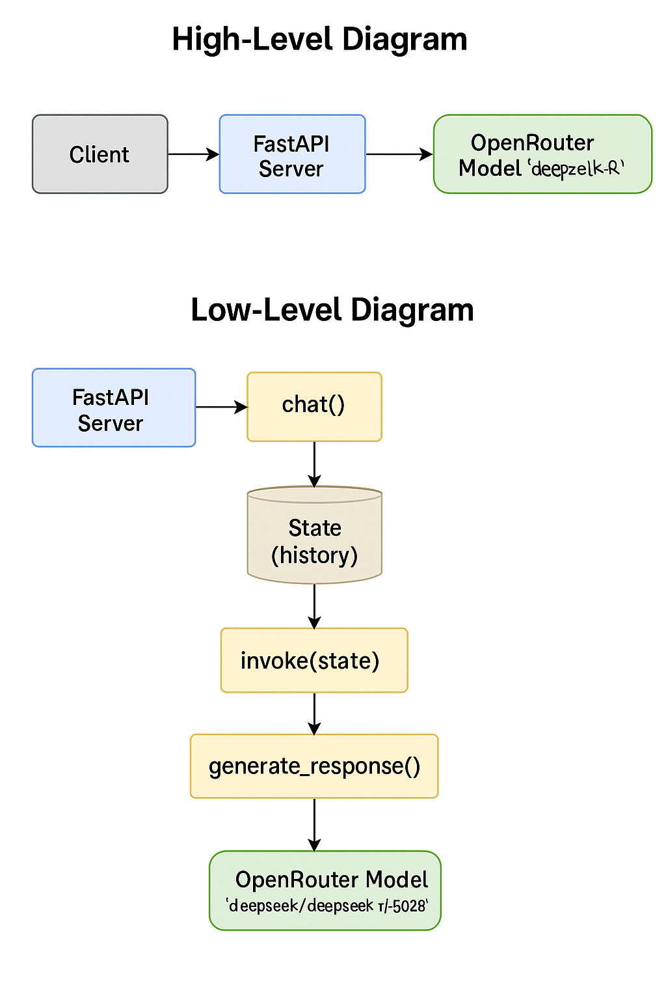

# 🤖 GraphMind API – AI Chat with LangGraph + FastAPI

https://graphmind-api.onrender.com -- Access it here.

An open-source beginner-friendly AI chat project using **LangGraph**, **FastAPI**, and **OpenRouter (free GPT/OpenAI alternatives)**.


---

## 🚀 Features

- 🌐 Built with **FastAPI** – Fast, simple web API
- 🧠 Uses **LangGraph** – Graph-based LLM orchestration
- 🔑 Uses `.env` for API keys securely
- 🔌 Plug-and-play OpenRouter model support
- 🗂️ Beginner-friendly project structure
- ⚡ Async-ready, production-extensible
- 📄 Swagger docs available at `/docs`

---

## 🗂️ Project Structure

```
graphmind-api/
│
├── app/
│   ├── flow.py        # LangGraph state graph setup
│   ├── nodes.py       # LLM + Response generation logic
│   ├── state.py       # Pydantic state definition
│
├── main.py            # FastAPI app entry point
├── .env               # 🔐 API keys and secrets (not committed)
├── .gitignore         # Git ignored files
├── requirements.txt   # Python dependencies
└── README.md          # You’re here
```

---

## 🧩 Prerequisites

- Python 3.10 or above
- pip
- Optional: Virtualenv

---

## ⚙️ Setup Instructions

### 1. Clone the project
```bash
git clone https://github.com/your-username/graphmind-api.git
cd graphmind-api
```

### 2. Create a virtual environment
```bash
python3 -m venv venv
source venv/bin/activate
```

### 3. Install dependencies
```bash
pip install -r requirements.txt
```

### 4. Create `.env` file
```env
OPENROUTER_API_KEY=sk-or-xxxxxxxxxxxxxxxxxxxxxxxxxxxxxxxxxxxxxxxxx
```

---

## ▶️ Run the Project

```bash
uvicorn main:app --reload --port 8015
python3 -m uvicorn main:app --reload --port 8015
```

Visit 👉 http://127.0.0.1:8011/docs to try out the `/chat` API!

---

## 🧪 Example API Usage

**Endpoint**:
```http
POST /chat?user_input=hello
```

**Response**:
```json
{
  "response": "Hi! How can I assist you today?"
}
```

---

## 📸 Screenshots

### 🔹 Swagger UI (`/docs`)


### 🔹 Terminal Output


---

## 💬 Supported Models via OpenRouter

You can use any of the free or cheap models:
- `deepseek/deepseek-r1-0528:free` ✅ (Free!)
- `google/gemini-pro`
- `openai/gpt-3.5-turbo`
- And many more from https://openrouter.ai/models

---

## 👥 Contributing

Contributions welcome! Open issues, suggest features, or send pull requests.

---

## 📄 License

MIT License © 2025 [Your Name]

---

## 🙏 Acknowledgements

- [LangGraph](https://github.com/langchain-ai/langgraph)
- [FastAPI](https://fastapi.tiangolo.com)
- [OpenRouter](https://openrouter.ai)
- [LangChain](https://github.com/langchain-ai/langchain)

---

🧠 *“From zero to graph-based AI with LangGraph. Let’s build!”*

# 🤖 GraphMind API

A beginner-friendly FastAPI project using **LangGraph**, **OpenRouter**, and **LangChain** to build an intelligent conversational API with support for Open Source LLMs like DeepSeek.

---

## 📌 Features

* 💬 Conversational chat endpoint (`/chat?user_input=Hello`)
* 🧠 LangGraph-powered state machine to manage conversation flow
* 🔓 Uses Open Source & Free LLMs via OpenRouter
* ✅ Secure key management with `.env`
* 🛡️ GitHub Push Protection integrated

---

## 📁 Project Structure

```bash
graphmind-api/
├── app/
│   ├── nodes.py        # LLM logic (uses OpenRouter)
│   └── state.py        # Shared graph state (chat history)
├── main.py             # FastAPI app with /chat endpoint
├── .env                # Secret key (not committed)
├── .gitignore          # Protects secrets & virtualenv
├── README.md           # This file
└── assets/             # Diagrams & screenshots
```

---

## 🚀 How to Run

### 1. Clone the Repository

```bash
git clone https://github.com/your-username/graphmind-api.git
cd graphmind-api
```

### 2. Create Virtual Environment

```bash
python3 -m venv venv
source venv/bin/activate
```

### 3. Install Requirements

```bash
pip install -r requirements.txt
```

### 4. Setup Environment Variables

Create a `.env` file:

```env
OPENROUTER_API_KEY=your-key-here
```

### 5. Run the Server

```bash
uvicorn main:app --reload
```

Visit: `http://127.0.0.1:8000/docs` to try the `/chat` endpoint.

---


## 🔄 Code Flow Explained

### 1. `main.py`

* Starts a FastAPI app
* Builds a LangGraph from `generate_response`
* Calls `graph.invoke()` with user input

```python
@app.post("/chat")
def chat(user_input: str):
    state = GraphState(messages=[{"role": "user", "content": user_input}])
    final_state = graph.invoke(state)
    return {"response": final_state.messages[-1]["content"]}
```

### 2. `app/state.py`

Defines the state type that moves across graph steps.

```python
class GraphState(TypedDict):
    messages: list[dict]  # Chat history
```

### 3. `app/nodes.py`

Initializes the LLM client using OpenRouter.

```python
llm = ChatOpenAI(
    model="deepseek-chat",
    api_key=os.getenv("OPENROUTER_API_KEY"),
    base_url="https://openrouter.ai/api/v1"
)

def generate_response(state: GraphState) -> GraphState:
    messages = state["messages"]
    response = llm.invoke(messages)
    messages.append({"role": "assistant", "content": response.content})
    return {"messages": messages}
```

### 4. LangGraph Setup

```python
builder = Graph()
builder.add_node("chat", generate_response)
builder.set_entry_point("chat")
graph = builder.compile()
```

---

## 📊 Visual Flow

> Add to README:

**High-Level:**

```
User Input ➔ /chat Endpoint ➔ GraphState ➔ LangGraph Node ➔ OpenRouter LLM ➔ Assistant Reply
```

**Low-Level:**

```
FastAPI
    └─ GET /chat
        └─ Create GraphState
            └─ LangGraph.invoke()
                └─ generate_response()
                    └─ ChatOpenAI (via OpenRouter)
                        └─ Returns response
```

---

## 📦 Tech Stack

* **FastAPI** - REST API Framework
* **LangGraph** - Graph-based LLM orchestrator
* **LangChain** - Abstraction layer for LLMs
* **OpenRouter** - API gateway for multiple free and open-source LLMs
* **DeepSeek** - Free, high-quality open LLM

---

## 🔐 Security & Best Practices

* API keys stored in `.env` (never hard-coded)
* `.gitignore` prevents leaking `.env` & `venv`
* GitHub Push Protection blocks secrets
